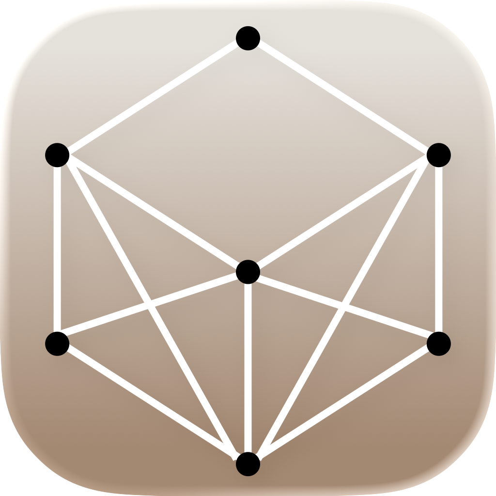
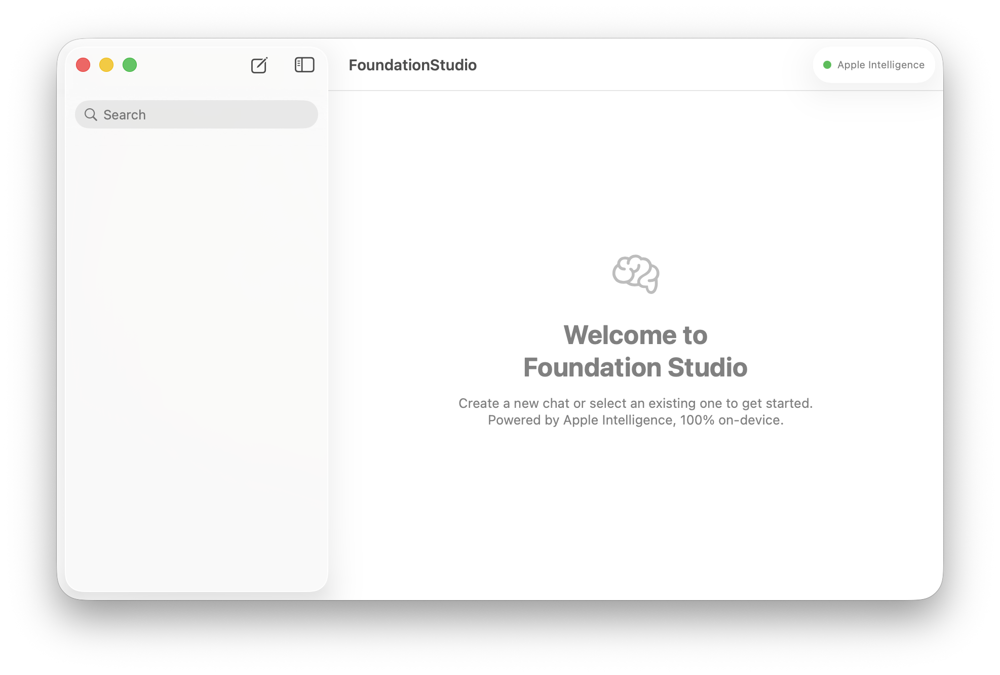
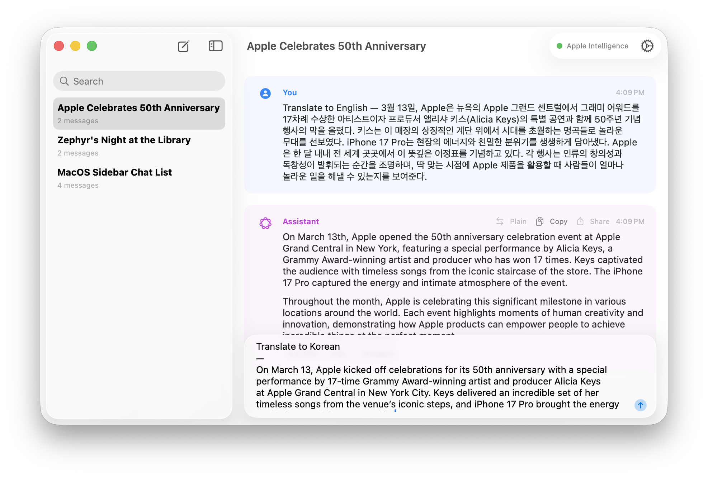
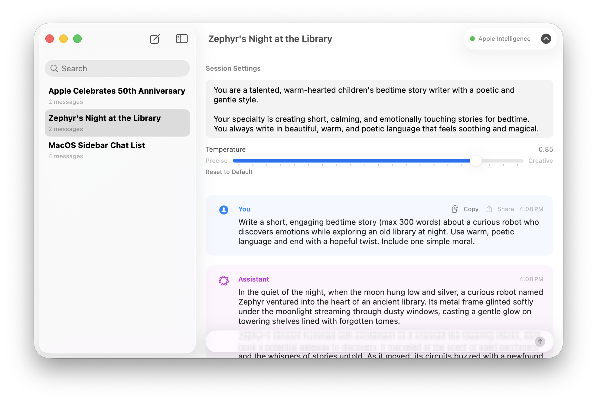
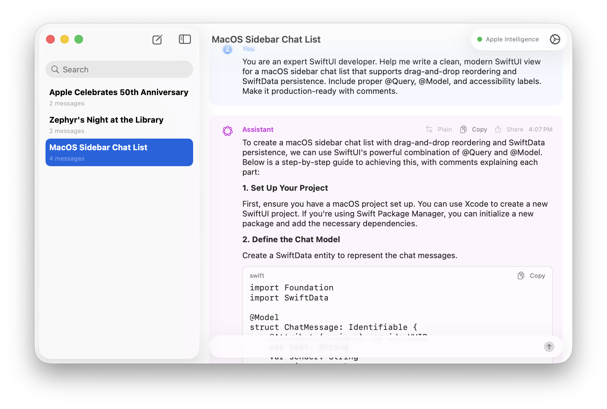

# Foundation Studio

<p align="center">
	
</p>

Foundation Studio is a native macOS chat app built with SwiftUI, SwiftData, and Apple's FoundationModels framework.

It is designed as a private, on-device AI workspace inspired by the layout and UX of Google AI Studio, while staying fully native to macOS.

## Why This Project

- 100% on-device LLM workflow with Apple Intelligence
- No API keys, no server backend, no network dependency for model inference
- Fast SwiftUI desktop UX with persistent chat history
- Practical reference app for FoundationModels + SwiftData integration

## Current Feature Set

- NavigationSplitView app shell with persistent sidebar chat list
- New chat creation and chat deletion
- Chat persistence using SwiftData models (`ChatThread`, `Message`, `PromptRecord`)
- FoundationModels integration via `SystemLanguageModel.default`
- Model availability awareness and status badge
- Streaming assistant responses in the chat surface
- Per-thread system instructions and temperature control
- Auto-generated conversation title from first exchange
- Markdown-style assistant rendering (headings, lists, code blocks, block quotes, inline formatting)
- Message utilities: copy, share, markdown/plain toggle, generation metrics (TPS, token count, duration)

## Screenshots

### Welcome



### Chat Translation Example



### Story Writing Example



### Coding Assistant Example



## Tech Stack

- SwiftUI (macOS app UI)
- SwiftData (`@Model`, `@Query`, relationship persistence)
- FoundationModels (`SystemLanguageModel`, `LanguageModelSession`)
- Observation (`@Observable`) for model service state

## Requirements

- macOS 26+ (Apple Silicon)
- Xcode with FoundationModels support (WWDC 2025+ SDK line)
- Apple Intelligence enabled on device

## Project Structure

```
FoundationStudio/
	FoundationStudio/
		FoundationStudioApp.swift
		ContentView.swift
		Models/
			ChatThread.swift
			Message.swift
			PromptRecord.swift
		Services/
			FoundationModelService.swift
		Views/
			SidebarView.swift
			ChatView.swift
			MessageBubbleView.swift
			MessageInputView.swift
			MarkdownContentView.swift
			ModelStatusBadge.swift
```

## Getting Started

1. Open `FoundationStudio/FoundationStudio.xcodeproj` in Xcode.
2. Select the `FoundationStudio` scheme.
3. Run on an Apple Silicon Mac with Apple Intelligence available.
4. Create a new chat and send your first prompt.

## Apple Intelligence Availability

The app reads `SystemLanguageModel.default.availability` and surfaces status in the UI.

Handled states include:

- Available
- Device not eligible
- Apple Intelligence not enabled
- Model not ready
- Other unavailable states

When unavailable, user-facing errors are shown in-thread as system messages.

## Data Model Notes

- `ChatThread`: conversation metadata, system instructions, temperature, relationships
- `Message`: role-based chat messages with optional generation metrics
- `PromptRecord`: prompt/response logs and generation metadata for review/reuse

## Agentic Coding Context

This repository includes the original seed prompt used to bootstrap the app design and implementation flow:

- See [`prompt.md`](./prompt.md)

That prompt captures the intended UX direction, feature order, and architectural constraints for iterative agentic development.

## Privacy

Foundation Studio is intended to run inference on-device using Apple Intelligence Foundation Models.

- No API keys required
- No cloud relay required for core chat inference
- Local SwiftData persistence

Always validate your own privacy and compliance requirements before production use.

## Roadmap

- Settings surface expansion (top-p, max tokens where exposed)
- Structured output flows with `@Generable`
- File/image attachment workflows
- Prompt library and reusable templates
- Export/import for threads and prompt records
- Command palette and menu extras

## Open Source Notes

- This project is an independent implementation inspired by Google AI Studio UX patterns.
- Google AI Studio and related marks are trademarks of their respective owners.

## Contributing

Issues and pull requests are welcome. For larger changes, open an issue first to discuss scope and approach.


## Credits
- [Ned Park](https://africastart.com)

## License
Licensed under the [MIT](LICENSE) license.